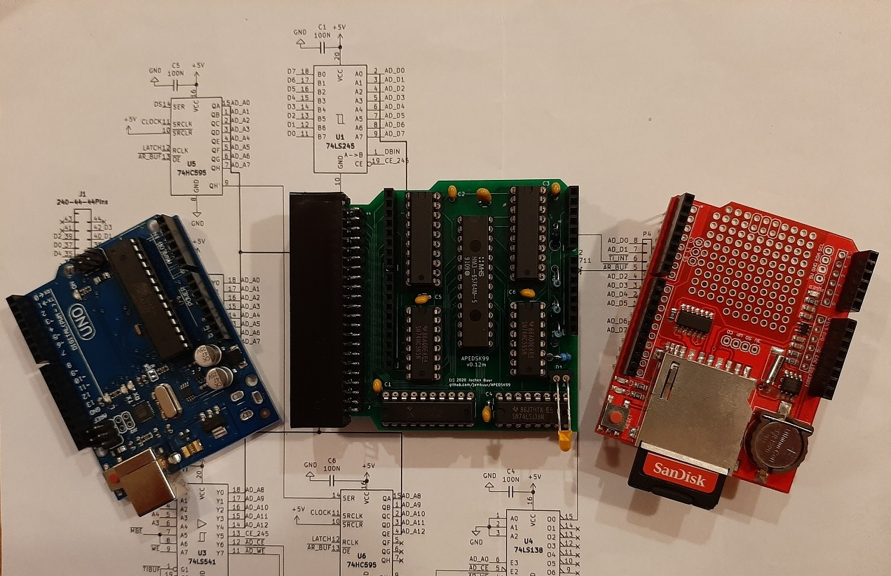

# APEDSK99
### *Arduino DSKx emulator shield for the TI99/4a*

APEDSK99 is an Arduino shield that emulates 3 DS/SD floppy drives for the TI99/4a home computer. It is used together with a SD card shield for storing Disk-On-A-Disk (DOAD) floppy images. The APEDSK99 shield plugs directly into the side port and is powered separately from a USB cable. 

Like the TI, APEDSK99 is based on good old through-hole technology. No risk of sneezing ruining your SMD day and it can be put together by anybody with basic electronics equipment and skills.

The TI <-> shield interface is the familiar design, with 74LS541 buffers for address/control lines and a bi-directional 74LS245 buffer for the databus. An 8Kx8 RAM stores the DSR code. CRU is emulated through 2 memory mapped addresses, simplifying shield design. 
A binary DSR file is loaded into RAM by the Arduino at powerup / reset. 

The Arduino UNO controls the TI interface, has R/W access to RAM, can halt the TI and tries to act as a FD1771. As GPIO pins are in rather short supply, Arduino RAM addressing is serial-to-parallel through 74HC595 shift registers. 

A status LED indicates APEDSK99 access as well as showing possible error codes.

The DSR is still very much the original TI Disk Controller ROM, but adapted to interface with a reliable SD card instead of wonky floppies. 
DSR code optimisation has made enough RAM available for handy _TI BASIC_ support and possible future enhancements. 

I have left the orginal program code in the DSR source and commented the changes I have made to make it work with SD cards. I think it's rather nice that most of the orginal programmers' cleverness lives on.

### *How does it work?*

When the TI issues a disk controller command by writing to the FD1771 registers, the Arduino receives an interrupt on one of its GPO pins. This interrupt is generated by a 74LS138 3->8 decoder which monitors the MBE*, WE* and A15 sideport signals. On receiving an interrupt, the Arduino then:

1. halts the TI by making READY low; this simultaneously enables the shift registers
2. disables the sideport interface buffers
3. enables the Arduino RAM control bus
4. executes the command including updating the relevant FD1771 and CRU "registers"
5. executes the opposite of steps 3, 2 and 1

### *Construction*

Putting the APEDSK99 shield together is straightforward. The 74LS541's and the slimline RAM are probably not stock items at your local electronics store but can be easily obtained online.

The KiCad files can be sent to your favourite online PCB maker (I use [JCLPCB](https://jlcpcb.com/)). 

The only thing that needs a little bit of attention is mounting the [edge connector](https://www.ebay.com/itm/5pc-Industrial-Card-Edge-Slot-Socket-Connector-22x2P-44P-2-54mm-0-1-3A-240-44/140888520037?ssPageName=STRK%3AMEBIDX%3AIT&_trksid=p2057872.m2749.l2649):
- The bottom row of pins need to be [bent 90 degrees downwards and the top row slightly bent upwards](img/APEDSK99conn.jpg)
- [Rough up](img/APEDSK99spaper.jpg) the bottom side of the connector housing and the PCB area it will sit on (between PCB edge and white line)
- Clean the 2 surfaces with isopropyl and [apply dots of superglue](img/APEDSK99sglue.jpg) across the length of 1 area
- Line up the bottom connector pins with the row of PCB holes marked 1-43 and press the connector firmly on the PCB, making sure all connector pins stick through to the soldering side. 

After clamping it for a while the bottom row pins can now be soldered. 

- The top row pins are soldered to the PCB via a [suitable length of standard header](img/APEDSK99connsold.jpg).

The [Arduino shield sandwich](img/APEDSK99stack.jpg) (UNO - APEDSK99 - SD) is attached to the TI sideport. I suggest you use some sort of padding between the UNO and your desk etc to prevent the stack from flapping in the breeze. It shouldn't be too hard to fit the stack into a neat little jiffy case.

As the 74LS series is getting harder to get, 74HCT replacements for the 74LS541's may be a better bet. Either works fine but you might have to tweak a delay-dependent parameter (NOP) in the Arduino APEDSK99_012m-B-hwfunc sketch. Default is set to 6uS for both the 74LS and 74HCT series. NB: I haven't tried HCT versions for the 74LS245, 74LS138 and 75HC595's so no guarantees there (should work though).

Another thing to note is that the Arduino stackable headers seem to come in a long and a short version. The short version won't let the APEDSK99 shield fit properly on the Arduino UNO as it interferes with the USB (type B) and the power adapter connectors. Make sure you get the long version.

### *DOAD's*

The SD card can be filled with as many DOAD's as you see fit :-) DOAD filenames must follow the MS-DOS 8.3 format and have a  ".DSK" extension. At powerup or reset the Arduino looks for optional "__APEDSK1.DSK" / "_APEDSK2.DSK" / "_APEDSK3.DSK" files and maps them accordingly so you can have your favourite apps ready to go. The DSR has support for DOAD management through TI BASIC CALL's. 

DOAD's need to be stored in the /DISKS/ folder on the SD card.

Once a DOAD is mapped to a particular DSK, it behaves very much like a normal (but rather speedy) floppy. Single-sided formatting takes about 15 seconds and verifying is unnecesary. Fun fact: single-sided DOAD's automagically become double-sided by formatting them accordingly. Reverse is also true but the DOAD will still take DD / 180KB of space on the SD (not that it matters with plenty of GB's to spare).

### *TI BASIC support*

The DSR contains 5 additional TI BASIC CALL's to manage DOAD's:

- [CALL PDSK( [1-3] )](img/PDSK_UDSK.jpg): sets the Protected flag at 0x10 in the Volume Information Block, preventing APEDSK99 writing to the DOAD. Although it's the same flag as used by some disk managers, it functions more like a virtual "adhesive tab" (remember those?) 

- [CALL UDSK( [1-3] )](img/PDSK_UDSK.jpg): removes the "tab"

- [CALL MDSK( [1-3] ,"*8 character DOAD name*")](img/SDSK_MDSK.jpg): maps DSK[1-3] to a DOAD. The DOAD name must be 8 characters, padded with spaces if necessary.

- [CALL SDSK( [1-3] )](img/SDSK_MDSK.jpg): shows the current DOAD mapping, Protect/Unprotect status and # of free sectors

- [CALL LDSK( [1-3] )](img/LDSK.jpg): list the files on a DOAD (I always thought that was a really nice feature the C64 had), 
their type (P)rogram /  (D)isplay / (I)nternal and size in sectors. 
A ">" indicates that the same LDSK() command will show the next lot of files.

2 further CALL's manage the optional Real Time Clock (RTC). Datalogger SD shields include a RTC but there are plenty of vanilla SD shields without it. I highly recommend one, very handy to have it for the TI:

- [CALL SRTC("*DDMMYYYYHHmm*")](img/GRTC_SRTC.jpg): sets the RTC

- [CALL GRTC()](img/GRTC_SRTC.jpg): displays the date and time

2 final CALL's concern the management of the DSR itself:

- [CALL ADSR("*8 character DSR file name*")](img/ADSR.jpg): loads a DSR file from the /DSR folder on the SD card and resets APEDSK99. 
DSR filenames need to have 8 characters (no spaces this time) and a .DSR extension.

- [CALL ARST()](img/ARST.jpg): resets APEDSK99 including reloading the current DSR. It is a handy way to get your DOAD mappings to their initial state. It is functionally the same as pressing the Arduino reset button and sort of the same but not really as power cycling. 

With the ADSR() and ARST() CALLs, keep in mind you might need to reset the TI if the relevant DSR powerup routines have not been executed previously. 

Any unsuccessful CALL returns a generic "INCORRECT STATEMENT" error (or "SYNTAX ERROR" in _TI EXTENDED BASIC_) so check syntax, DOAD name/length etc.

All CALLs use a simple 2-way 16 byte buffer for data exchange at @>5FD6 in the DSR address space. It allows you to manipulate the buffer from assembly or BASIC's CALL LOAD and execute the relevant Arduino routine directly (see "*direct call examples*" in the documentation).
This lets _TI EXTENDED BASIC_ join the running program party as it only supports DSR CALL's from the "command prompt"

### *Updating the DSR*

I compile the DSR .a99 file with [xtd99 TI99 cross development tools](https://endlos99.github.io/xdt99/) and then use [this hex editor](https://mh-nexus.de/en/hxd/) for padding the binary file with zero's to the full 8KB. After that it's just a matter of saving the binary file as APEDSK99.DSR in the root of the SD.

### *Uploading Sketches*

You should switch off the TI before uploading the APEDSK99 sketch from the Arduino IDE. If you don't, there is a good chance the Arduino bootloader gets corrupted and you'll need a second Arduino to restore it. Yes I have been there ... several times.  

Alternatively you could connect _Analog 1_ to _+5V_ with a jumper wire before uploading; this disables the APEDSK99 sideport buffer IC's so you can leave the TI powered on. In fact, if you intend to put APEDSK99 in some sort of case, plan a switch for this. It's not only handy for uploading sketches but also for temporarily circumventing _TI EXTENDED BASIC_'s LOAD feature or preventing unintentional DSR RAM writes (see _**Ignition Sequence**_ below)

### *Ignition sequence*

Unlike the original TI Disk Controller ROM, the APEDSK99 DSR sits in RAM and is permanently enabled within the TI's address space. Any unintentional write from the TI can potentially corrupt the DSR code. This could happen for instance when you switch the TI on (spurious signals on the sideport) or insert a cartridge.

So switch on the TI first, apply power to APEDSK99, wait a second for APEDSK99 to load the DSR (short glow from the LED) and then soft-reset the TI with FCTN-QUIT.

### *Error codes*

The LED can flash in the following intricate error patterns:

1. *flash*            : SPI / SD Card fault/not ready
2. *flash-flash*      : can't read DSR binary image (/APEDSK99.DSR)
3. *flash-flash-flash*: no valid DSR header (>AA) at DSR RAM >4000

### *QA*

Writing software is a hobby, not my profession. No doubt some gurus would achieve the same functionality with half the code. But I dare to say that at least the basic DSR I/O routines in the sketch are reasonably efficient, useful and fast. Anyway I am content with dusting off that stack of virtual floppies, have a beer and admire my work. 

The Arduino SD library is not the fastest option, there are alternatives available that would speed up DSKx access a bit. But I have decided to stay with the standard option; it is fast enough not to be irritating but still keeps some of that floppy nostalgia. I don't know about you but emulators with instant loading times always strike me as so ... not real ;-)

Anyway feel free to improve and share!

### *Bug's*

If a particular program or module behaves nicely by accessing disks solely through the regular DSR routines there shouldn't be any new ones (are there any existing disk controller bugs?) In other words, any funky direct disk access and weird copy protection schemes will likely fail. 

### *Future*

After (of course) I came up with the name APEDSK99 I realised that DSK emulation is just a first application. The APEDSK99 shield is actually a generic DSR interface to a substantial catalogue of available Arduino shields ... including very useful ones such as Ethernet / WiFi. It would be rather easy to implement a full TCP/IP stack with the generic APEDSK99 DSR routines and some Arduino sketches. Mmmm I guess this would be a nice follow-up project ...

Initially I considered using a bigger RAM size for larger and/or concurrent DSR's. But after optimising  Arduino RAM R/W access I had DSR loading times reduced to ~450ms so switching DSR's based on CALL's would be entirely feasible. I will go with that approach for now. 

### *Acknowledgements*

This project owes a lot to Thierry Nouspikel's marvelous [TI Tech Pages website](http://www.unige.ch/medecine/nouspikel/ti99/disks.htm) which has a wealth of information on the TI Disk Controller, including a commented disassembly of its DSR ROM.

Another great source of information has been Monthy Schmidt's excellent book [Technical Drive](img/MSTDrive.jpg). Monty went on to do great things, check out [SoundForge](https://www.magix.com/us/music/sound-forge/).

The Arduino's serial-to-parallel RAM addressing scheme is neither new or mine but I have gratefully used part of [this excellent project](https://github.com/mkeller0815/MEEPROMMER) by Mario Keller.

Last but not least I virtually stumbled across my old friend Frederik "Fred" Kaal who I hadn't seen for 30 years after moving to the other side of the globe. Long live the Web and places such as AtariAge. Fred was a TI wizzard back then and [still very much is](http://ti99-geek.nl). His expert input has been of great help.

