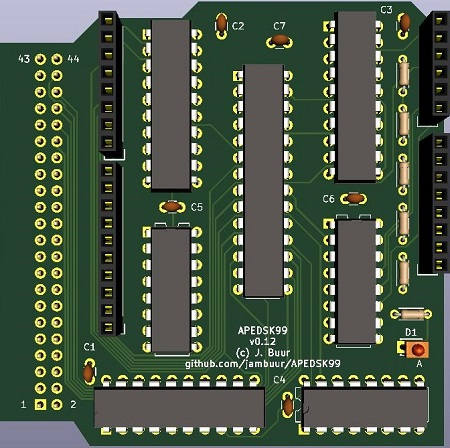

# APEDSK99
### *Arduino DSKx emulator shield for the TI99/4a*

APEDSK99 is an Arduino shield that emulates 3 DS/SD floppy drives for the TI99/4a home computer. It is used together with a SD card shield for storing Disk-On-A-Disk (DOAD) floppy images.

For nostaligic, authentic and I-just-don't-enjoy-SMD-soldering reasons, APEDSK99 is based on good old through-hole technology.

The interface to the TI is the classic design with 2x 74LS541 for address/control and a 74LS245 for the databus. An 8Kx8 RAM contains the DSR code, uploaded by the Arduino at powerup.

The DSR is a modified TI Disk Controller version. CRU is emulated through 2 memory mapped addresses, simplifying shield design (well, I ran out of GPIO pins). Optimising for reliable SD cards instead of wonky floppies saw quite some code removed, freeing up valuable DSR space for future enhancements.

The Arduino UNO controls the TI interface, has R/W access to RAM, can halt the TI and tries to act as a FD1771. Due to the limited number of GPIO pins available, R/W to RAM is a serial-to-parallel scheme through 74HC595 shift registers. This idea is neither new or mine but I have gratefully used part of [this excellent project](https://github.com/mkeller0815/MEEPROMMER) by Mario Keller.

When the TI issues a disk controller command, the Arduino receives an interrupt through a 74LS138. The Arduino then:

1. disables the TI interface
2. halts the TI
3. enables Arduino RAM access
4. executes the command including updating the relevant registers/emulated CRU
5. executes the opposite of steps 3, 2 and 1

This project owes a lot to Thierry Nouspikel's marvelous [TI Tech Pages website](http://www.unige.ch/medecine/nouspikel/ti99/disks.htm) which has a wealth of information on the TI Disk Controller, including a commented disassembly of its DSR ROM.

Another valuable source of information has been Monthy Schmidt's excellent book "Technical Drive".

Some things dreamed up for possible future APEDSK DSR versions are utilising the realtime clock on the SD card, dynamically mapping DOAD images and switching DSR's from the main menu or TI BASIC. Switching DSR's would allow other Arduino peripherals to be used such as the Ethernet shield (tinytcp!)

