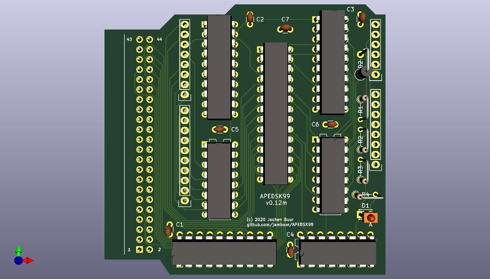

# APEDSK99
### *Arduino DSKx emulator shield for the TI99/4a*

APEDSK99 is an Arduino shield that emulates 3 DS/SD floppy drives for the TI99/4a home computer. It is used together with a SD card shield for storing Disk-On-A-Disk (DOAD) floppy images. The APEDSK99 shield plugs directly into the side port and is powered separately from a USB cable. 

APEDSK99 is based on good old through-hole technology. I don't know about you but I don't get any pleasure from SMD soldering.

The TI shield interface is the familiar design, with 74LS241's (74LS541's actually; easier PCB layout) for address/control lines and a 74LS245 for the databus. An 8Kx8 RAM stores the DSR code. 

The DSR is a modified TI Disk Controller ROM version with the bulk of the changes made to the various low level routines. CRU is emulated through 2 memory mapped addresses, simplifying shield design. The DSR, an 8KB binary file (APEDSK99.DSR) in the root of the SD , is loaded into RAM by the Arduino at powerup or reset. By optimising the DSR for reliable SD card access instead of wonky floppies there is a about 1KB DSR space left for future enhancements. 

The Arduino UNO controls the TI interface, has R/W access to RAM, can halt the TI and tries to act as a FD1771. Due to the limited number of GPIO pins available, the Arduino RAM interface is a serial-to-parallel scheme through 74HC595 shift registers. 

A LED (yellow or orange of course) indicates APEDSK99 access.

### *How does it work?*

When the TI issues a disk controller command by writing to one of the FD1771 registers, the Arduino receives an interrupt through a 74LS138 3->8 decoder.  The Arduino then:

1. disables the TI interface buffers
2. halts the TI by making READY low; this also enables the shift registers
3. enables the Arduino RAM control bus
4. executes the command including updating the relevant FD1771 and CRU registers
5. executes the opposite of steps 3, 2 and 1

### *Construction*

Putting the APEDSK99 shield together is straightforward and no problem to anybody with basic electronic skills. The 74LS541's and the slimline RAM are probably not stock items at your local electronics store but can be easily obtained online.

The KiCad files can be sent to your favourite online PCB maker (I use [JCLPCB](https://jlcpcb.com/)).

The only thing that needs a little bit of attention is mounting the [edge connector](https://www.ebay.com/itm/5pc-Industrial-Card-Edge-Slot-Socket-Connector-22x2P-44P-2-54mm-0-1-3A-240-44/140888520037?ssPageName=STRK%3AMEBIDX%3AIT&_trksid=p2057872.m2749.l2649). The bottom row of pins need to be bent 90 degrees downwards and the top row slightly bent upwards (no more than 45 degrees). Rough up the bottom side of the connector housing and the PCB area it will sit on (between edhe and white line). Clean the 2 surfaces with isopropyl and apply some superglue to either one of them. Line up the bottom connector pins with the holes in the PCB (1 - 43) and press the connector firmly on the PCB, making sure all connector pins stick through to the soldering side. After clamping it for a while you can   the bottom row pins can now be soldered. The top row pins are soldered to the PCB via a suitable length of standard header.

The Arduino shield stack (UNO - APEDSK99 - SD) is attached to the TI sideport. I suggest you use some sort of padding between the UNO and your desk etc to prevent the stack from flapping in the breeze. I leave any ideas of housing the stack to your imaginition but I will post details of my solution once finished.

### *DOAD's*

The SD card can be filled with as many DOAD's as you see fit :-) DOAD filenames must follow the MS-DOS 8.3 format and have a  ".dsk" extension. At powerup / reset the Arduino looks for optional "DSK1.dsk" / "DSK2.dsk" / "DSK3.dsk" files and maps them accordingly so you can have your favourite apps ready to go. The DSR has support for DOAD management through TI BASIC CALL's. 

Once a DOAD is mapped to a particular DSK, it behaves very much like a normal (but quite fast) floppy. Formatting a single-sided "floppy" takes about 15 seconds. Fun fact: single-sided DOAD's automagically become double-sided by formatting them accordingly. 

### *BASIC support*

The DSR contains 3 additional TI BASIC CALL's to manage DOAD's:

CALL PDSK([1-3]): This subprogram applies a virtual "adhesive tab" (remember those?) by setting a flag in the Volume Information Block. This flag prevents APEDSK99 writing to the DOAD. Keep in mind that this is separate to the familiar Protected flag as used by disk managers.

CALL UDSK([1-3]): This subprogram removes the virtual "adhesive tab"

CALL CDSK([1-3],"8 character DOAD name"): This subprogram maps DSK[1-3] to a DOAD. The DOAD name must be 8 characters, padded with the appropriate amount of spaces if shorter.

When a CALL is unsuccesful it generates an "* INCORRECT STATEMENT" error.

### *Uploading Sketches*

You definitely should switch off the TI before uploading the APEDSK99 sketch from the Arduino IDE. If you don't, there is a good chance the Arduino bootloader gets corrupted and you'll need a second Arduino to restore it. Yes I have been there ... several times.  

Alternatively you could connect Analog 1 to +5V with a jumper wire before uploading ; this disables the sideport buffer IC's so you can leave the TI powered on. 

### *Ignition sequence*

Switch the TI on first, apply power to APEDSK99, wait a second for APEDSK99 to load the DSR (faint glow from the LED) and then soft-reset the TI. This sequence prevents the TI corrupting the DSR RAM at powerup.

### *BUG's*

If a particular program or module behaves nicely by accessing disks solely through the regular DSR routines there shouldn't be any new ones (are there any existing disk controller bugs?) In other words, any funky direct disk access and weird copy protection schemes will surely fail. 

### *Future*

After I came up with the name APEDSK99 I brainwaved that DSK emulation is just a first application. The shield is actually a generic DSR interface to a substantial catalogue of available Arduino shields ... including very useful ones such as Ethernet / WiFi. Instead of trying to squeeze say a tiny SLIP stack into the TI, it's just a matter of adjusting the existing DSR and Bob's your uncle. 

Speaking of DSR's, initially I considered using a bigger RAM size for larger and/or concurrent DSR's. But after optimising  Arduino RAM R/W access I had DSR loading times reduced to ~450ms so switching DSR's based on CALL's would be entirely feasible. I will go with that approach for now.  

### *Acknowledgements*

This project owes a lot to Thierry Nouspikel's marvelous [TI Tech Pages website](http://www.unige.ch/medecine/nouspikel/ti99/disks.htm) which has a wealth of information on the TI Disk Controller, including a commented disassembly of its DSR ROM.

Another great source of information has been Monthy Schmidt's excellent book "Technical Drive". Monty went on to do great things, check out [SoundForge](https://www.magix.com/us/music/sound-forge/).

The Arduino's serial-to-parallel RAM addressing scheme is neither new or mine but I have gratefully used part of [this excellent project](https://github.com/mkeller0815/MEEPROMMER) by Mario Keller.

Last but not least I virtually stumbled across my good friend Frederik "Fred" Kaal who I hadn't seen for 30 years after moving to the other side of the globe. Long live the Web and places such as AtariAge. Fred was a TI wizzard back then and still very much is. His expert input has been invaluable.

