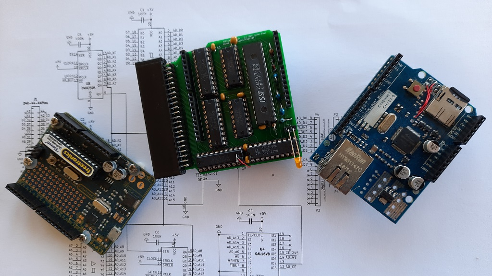
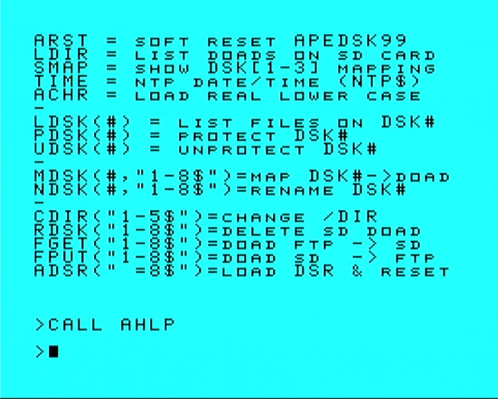

# 30/1/2021: Work In Progress, files section not updated yet!

# APEDSK99
### *Arduino DSKx emulator / 32K / FTP / NTP shield for the TI99/4a*

APEDSK99 is an Arduino shield that emulates 3 DS/SD floppy drives for the TI99/4a home computer. Combined with a Ethernet / SD shield it allows you to load and save Disk-On-A-Disk (DOAD) single and double sided floppy images on a SD card or FTP server. It includes the necessary 32K RAM expansion and adds TI-BASIC access to NTP date and time. The APEDSK99 shield plugs directly into the side port and is powered separately from a USB cable. 

Like the TI, APEDSK99 is based on good old through-hole technology. No risk of sneezing ruining your SMD day and it can be put together by anybody with basic soldering skills.

The TI<->shield interface is the familiar design, with 74LS541 buffers for address lines and a bi-directional 74LS245 buffer for the databus.  A 64Kx8 RAM stores the DSR code and provides the 32K RAM expansion. CRU is emulated through memory mapped addresses, simplifying shield design. 
A user-selectable binary DSR file is loaded into RAM by the Arduino at powerup / reset. 

The Arduino UNO controls the TI interface, has R/W access to RAM, can halt the TI and tries to act as a FD1771. As GPIO pins are in rather short supply, Arduino RAM addressing is serial-to-parallel through 74HC595 shift registers. 

A status LED indicates APEDSK99 access as well as showing possible error codes.

The DSR is still very much the original TI Disk Controller ROM, but adapted to interface with a reliable SD card instead of wonky floppies. 
DSR code optimisation made enough RAM available to include some useful _TI BASIC_ CALL routines. 

I have left the orginal program code in the DSR source and commented the changes I have made to make it work with SD cards. I think it's rather nice that most of the orginal programmers' blood, sweat and tears lives on.

### *How does it work?*

When the TI issues a disk controller command by writing to the FD1771 registers, the Arduino receives an interrupt on one of its GPO pins. This interrupt is generated by a GAL which monitors A0, A13, A14, A15, WE* and MEMEN* sideport signals. On receiving an interrupt, the Arduino then:

1. halts the TI by making READY low; this simultaneously enables the shift registers
2. disables the sideport interface buffers
3. enables the Arduino RAM control bus
4. executes the command including updating the relevant FD1771 and CRU "registers"
5. executes the opposite of steps 3, 2 and 1

### *APEDSK99 Construction*

Putting the APEDSK99 shield together is straightforward. 

The KiCad files can be sent to your favourite online PCB maker (I use [JCLPCB](https://jlcpcb.com/)). 

The three things that need a little bit of attention are: 

#### 1. mounting the [edge connector](img/CONN22x2P44P25401.jpg)
- The bottom row of pins need to be [bent 90 degrees downwards and the top row slightly bent upwards](img/APEDSK99conn.jpg)
- [Rough up](img/APEDSK99spaper.jpg) the bottom side of the connector housing and the PCB area it will sit on (between PCB edge and white line)
- Clean the 2 surfaces and [apply dots of superglue](img/APEDSK99sglue.jpg) across the length of 1 area
- Line up the bottom connector pins with the row of PCB holes marked 1-43 and press the connector firmly on the PCB, making sure all connector pins stick through to the soldering side. After clamping it for a bit to let the glue dry, the bottom row pins can now be soldered. 
- The top row pins are soldered to the PCB via a [suitable length of standard header](img/APEDSK99connsold.jpg).

#### 2. installing the RAM IC 
The initial APEDSK99 version used a slimline 8Kx8 RAM and little did I know that the 32Kx8 RAM would be slimline+. I decided against a major PCB redesign so you have to make the RAM fit. This is not that difficult: bend the pins at a slight angle under the chip and then bend the very end of the pins back straight (needlenose pliers). Without too much fiddling the IC will fit the smaller hole pattern and leave plenty of pin material sticking through for soldering. This also works with a machined IC socket.

The [Arduino shield sandwich](img/SANDWICH.jpg) (UNO - APEDSK99 - ETHERNET/SD) is attached to the TI sideport. I suggest you use some sort of padding between the UNO and your desk etc to prevent the stack from flapping in the breeze. It shouldn't be too hard to fit the stack into a neat little jiffy case.

One other thing to note is that the Arduino [stackable headers](img/SHEADER.jpg) seem to come in a long and a short version. The short version won't let the APEDSK99 shield fit properly on the Arduino UNO as it interferes with the USB type B and the power adapter connectors. Make sure you either get the long version. Alternatively you could use an UNO with a micro-USB connector and de-solder its power adapter connector.

#### 3. Possible Ethernet / SD shield [modifcations](img/ESHIELDMOD.jpg)
Depending on your Ethernet / SD shield version some minor surgery may be necessary. My version has SPI available through a separate 6 pin header only, not at the familiair D11-D14 (why? why?). If this is the case with your shield, you will need to extend the SPI signals to D11-D14 with some extra wiring.

Most Ethernet / SD shields use D4 for the SD CS pin. This also happens to be APEDSK99 D3 (as in databus, not in Arduino digital pin) and this combo function doesn't work. Bend D10 and D4 inwards and connect [2 jumper wires](img/JUMPER.jpg): D10 to D2 (moves Ethernet CS to D2) and D4 to APEDSK99 D10 (moves SD CS to D10). 

### *GAL*

Memory decoding and interrupt generation is done through a 16V8 GAL. It was my first experience with these magic devices and needless to say I am hooked (yes I know they are sort of obsolete). You will need a suitable programmer to program the GAL with the supplied PLD file.

### *DOAD's*

DOAD's need to be stored in a /DISKS/ folder on the SD card or on a FTP server. DOAD filenames must follow the DOS 8.3 format and have a ".DSK" extension. At powerup or reset the Arduino looks for optional "__APEDSK1.DSK" / "_APEDSK2.DSK" / "_APEDSK3.DSK" files and maps them accordingly so you can have your favourite apps ready to go. The DSR has support for DOAD management through TI BASIC CALL's (see below).

Once a DOAD is mapped to a particular DSK, it behaves very much like a normal (but rather speedy) floppy. Single-sided formatting takes about 15 seconds and verifying is unnecesary. Fun fact: single-sided DOAD's automagically become double-sided by formatting them accordingly. Reverse is also true but the DOAD will still take DD / 180KB of disk space (not that it matters with likely plenty of SD or FTP GB's to spare).

### *TI BASIC support*

The DSR includes additional TI BASIC CALL's to manage DOAD's. There is really only one to remember and that's CALL AHLP; it shows the following help screen:

- CALL ARST resets APEDSK99 including reloading the current DSR. It is a handy way to get your DOAD mappings to their initial state. It is functionally the same as pressing the Arduino reset button and sort of the same but not really as power cycling. 
- CALL SDIR list the DOAD's in the /DISKS/ directory on the SD card including single sided (1S) or double sided (2S)
- CALL SDSK shows the current DSK->DOAD mappings, Protect/Unprotect status and # of free sectors
- CALL TIME gets the current date and time from your NTP server of choice for display in TI-BASIC. The CONFIG sketch only requires a couple of parameters changed to get it going. If a BASIC variable NTP$ (16 chars) exists prior to the CALL, it will get assigned the NTP data. This command is also handy to check basic network connectivity is available.
- CALL PDSK and CALL UDSK apply or remove a virtual "sticker tab" (remember those?). With the "tab" applied, APEDSK99 can't write to the DOAD. Under the hood the Protected flag at 0x10 in the Volume Information Block is set/reset.
- CALL LDSK list the files on a DOAD (I always thought that was a really nice C64 feature), type (P)rogram / (D)isplay / (I)nternal and size in sectors.
- CALL MDSK maps DSK[1-3] to a DOAD. The DOAD file name is the DOS max 8 character part without the extension.  
- CALL RDSK removes a DOAD from the SD card. In line with BOFH standards no confirmation is required :-)
- CALL FGET and CALL FPUT load or save a DOAD from your FTP server of choice. Configuration on the APEDSK99 side is straightforward, with again just a couple of parameters in the CONFIG sketch. The FTP server side can be a bit more involved, especially regarding rights of the relevant FTP user for reading and writing in the /DISKS folder. FTP server logging is your friend here. 
- CALL ADSR loads a DSR file from / on the SD card and resets APEDSK99. If the DSR file doens't exist or is invalid the default file APEDSK99.DSR will be loaded instead. The current DSR filename is stored in EEPROM so will survive resets and powerdowns. ADSR() may require a soft-reset to execute any DSR powerup routines. 

SDIR and LDSK may generate multiple screens of info. A ">" will show up at the bottom right for you to press either <SPACE> for the next screen or <ENTER> to go back to the TI-BASIC prompt.

Any unsuccessful CALL returns a generic "INCORRECT STATEMENT" error (or "SYNTAX ERROR" in _TI EXTENDED BASIC_) so check syntax, DOAD name etc.

All CALLs use a simple 2-way 18 byte buffer for data exchange at @>5FD6 in the DSR address space. It allows you to manipulate the buffer from assembly or BASIC's CALL LOAD and execute the relevant Arduino routine directly (see "*direct call examples*" in the documentation).
This lets _TI EXTENDED BASIC_ join the running program party as it only supports DSR CALL's from the "command prompt"

See the CALLs in action at https://youtu.be/MDsME0TLIYE

### *Updating the DSR*

I compile the DSR .a99 file with [xtd99 TI99 cross development tools](https://endlos99.github.io/xdt99/) and then use [this hex editor](https://mh-nexus.de/en/hxd/) for padding the binary file with zero's to the full 8KB. After that it's just a matter of saving the binary file as APEDSK99.DSR in the root of the SD.

### *Uploading Sketches*

You should switch off the TI before uploading the APEDSK99 sketch from the Arduino IDE. If you don't, there is a good chance the Arduino bootloader gets corrupted and you'll need a second Arduino to restore it. Yes I have been there ... several times.  

Alternatively you could connect _Analog 1_ to _+5V_ with a jumper wire before uploading; this disables the APEDSK99 sideport buffer IC's so you can leave the TI powered on. In fact, if you intend to put APEDSK99 in some sort of case, plan a switch for this. It's not only handy for uploading sketches but also for temporarily circumventing _TI EXTENDED BASIC_'s LOAD feature or preventing unintentional DSR RAM writes (see _**Ignition Sequence**_ below)

### *Ignition sequence*

Unlike the original TI Disk Controller ROM, the APEDSK99 DSR sits in RAM and is permanently enabled within the TI's address space. Any unintentional write from the TI can potentially corrupt the DSR code. This could happen for instance when you switch the TI on (spurious signals on the sideport) or insert a cartridge.

So switch on the TI first, apply power to APEDSK99, wait a second for APEDSK99 to load the DSR (short glow from the LED) and then soft-reset the TI with FCTN-QUIT.

### *Error codes*

The LED can flash in the following intricate error patterns:

1. *flash*            : SPI / SD Card fault/not ready
2. *flash-flash*      : can't read DSR binary image (/xxxxxxxx.DSR)
3. *flash-flash-flash*: no valid DSR header (>AA) at DSR RAM >4000

### *Some predictive Q&A*

Writing software is a hobby, not my profession. No doubt some gurus would achieve the same functionality with half the code. But I dare to say that at least the basic DSR I/O routines in the sketch are reasonably efficient, useful and fast. Anyway I am content with dusting off that stack of virtual floppies, have a beer and admire my work. 

Feel free to improve and share!

### *Bugs*

If a particular program or module behaves nicely by accessing disks solely through the regular DSR routines (including low level sector R/W) there shouldn't be any new ones (are there any existing disk controller bugs?) In other words, any funky index hole math and weird copy protection schemes will likely fail. 

### *Future*

After (of course) I came up with the name APEDSK99 I realised that DSK emulation is just a first application. The APEDSK99 shield is actually a generic DSR interface to a substantial catalogue of available Arduino shields.

Also, the Arduino has full access to the 32K RAM expansion; this provides options for all sorts of fast data sharing between networked devices and the TI.

### *Acknowledgements*

This project owes a lot to Thierry Nouspikel's marvelous [TI Tech Pages website](http://www.unige.ch/medecine/nouspikel/ti99/disks.htm) which has a wealth of information on the TI Disk Controller, including a commented disassembly of its DSR ROM.

Another great source of information has been Monty Schmidt's excellent book [Technical Drive](img/MSTDrive.jpg). Monty went on to do great things, check out [SoundForge](https://www.magix.com/us/music/sound-forge/).

The Arduino's serial-to-parallel RAM addressing scheme is neither new or mine but I have gratefully used part of [this excellent project](https://github.com/mkeller0815/MEEPROMMER) by Mario Keller.

Last but not least I virtually stumbled across my old friend Frederik "Fred" Kaal who I hadn't seen for 30 years after moving to the other side of the globe. Long live the Web and places such as AtariAge. Fred was a TI wizzard back then and [still very much is](http://ti99-geek.nl). His expert input has been of great help.
