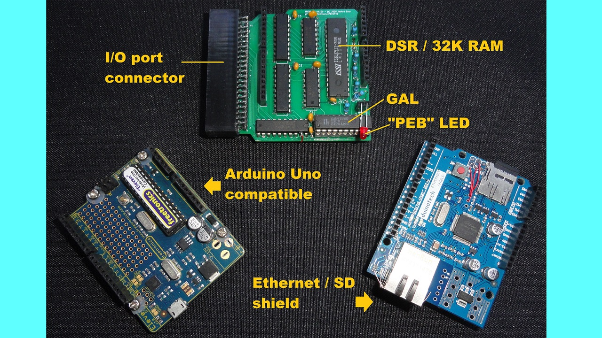

# APEDSK99 (Arduino Peripheral Expansion for the TI-99/4a)

### *February 2023: MAJOR UPDATE in progress*

Check the TI Italian User Club for a review of the new version: https://www.ti99iuc.it/web/index.php?pagina=articoli&artid=219#.Y-gqDi9BxaS

Currently working on updating this Github page, Youtube channel etc. Biggest takeaway is that APEDSK99 is now pretty much plug and play. 
I am thinking of either supplying pre-assembled APEDSK99 shields, leaving it to you to source a cheap Arduino UNO + Ethernet Shield combo from Ebay, AliExpress etc.
Alternatively, I could supply complete kits; I have also been approached by a web shop interested in the same. 
Stay tuned :-) 

### *Arduino-based DSKx emulator / 32K / FTP / NTP shield for the TI99/4a*

APEDSK99 is an Arduino shield that emulates 3 DS/DD/80T floppy drives for the TI99/4a home computer. Combined with a Arduino UNO and an Ethernet / SD shield it allows you to load, save and use disk floppy images (DOAD) on a SD card or FTP server. It includes the necessary 32K RAM expansion and adds NTP date and time to BASIC. The APEDSK99 shield plugs directly into the side port and is powered separately from a USB cable. 

Like the TI, APEDSK99 is based on good old through-hole technology. The TI<->shield interface is the familiar design, with 74HCT541 buffers for address lines and a bi-directional 74LS245 buffer for the databus.  A 64Kx8 RAM stores the DSR code and provides the 32K RAM expansion. CRU is emulated through memory mapped addresses, simplifying shield design. A user-selectable binary DSR file is loaded into RAM at >4000 by the Arduino at powerup / reset. 

The Arduino UNO controls the TI interface, has R/W access to RAM, can halt the TI and tries to act as a FD1771. As GPIO pins are in rather short supply, Arduino RAM addressing is serial-to-parallel through 74HC595 shift registers. 

A status LED indicates APEDSK99 access as well as showing possible error codes.

The DSR is still very much the original TI Disk Controller ROM, but adapted to interface with a reliable SD card instead of wonky floppies. 
DSR code optimisation made enough RAM available to include some useful BASIC CALL routines. I think it's rather nice that most of the orginal programmers' blood, sweat and tears lives on.

### *How does it work?*

When the TI issues disk controller commands by writing to the various FD1771 registers, the Arduino receives an interrupt on one of its GPO pins. This interrupt is generated by a GAL which monitors A0, A13, A14, A15, WE* and MEMEN* sideport signals. On receiving an interrupt, the Arduino then:

1. halts the TI by making READY low; this simultaneously enables the shift registers
2. disables the sideport interface buffers
3. enables the Arduino RAM control bus
4. executes the command including updating the relevant FD1771 and CRU "registers"
5. executes the opposite of steps 3, 2 and 1

The GAL also does the memory decoding for the 32K memory expansion.

### *DOAD's*

DOAD's are stored in root folders on the SD card or on a FTP server. Default APEDSK99 files include a DISKS folder with a bunch of useful images to get you started. DOAD filenames must follow the DOS 8.3 format and have a ".DSK" extension. At powerup or reset the Arduino looks for optional \_APEDSK1.DSK / \_APEDSK2.DSK / \_APEDSK3.DSK_ files and maps them accordingly so you can have your favourite apps ready to go. The DSR includes all necessary CALL's for DOAD and DSK management.

Once a DOAD is mapped to a particular DSK, it behaves very much like a normal (but rather speedy) floppy. 

Regarding FTP, on my setup (a Linux server with VSFTP within the same LAN segment) I get about ~22Kbyte upload / download speed. In practice it means 6-7 seconds between the TI-BASIC FTP CALL for a SS/SD image and back to the friendly flashing cursor.

### *BASIC support*

The DSR includes some 15 additional BASIC CALL's but there is really only one to remember, **CALL AHLP**:

  

**CALL ARST** resets APEDSK99 including reloading the current DSR. It is a handy way to get your DOAD mappings to their default state. It is functionally the same as pressing the Arduino reset button and sort of the same but not really as power cycling. 

**CALL LDIR** list the DOAD's in the current selected directory on the SD card, displaying the DOAD name, TI DISK name and DSK characteristics:

  

**CALL SMAP** shows the current DSKx -> DOAD mappings, extended info and the available directories on the SD Card:

  

**CALL TIME** gets the current date and time from an NTP server. If you define a BASIC variable NTP$ of exactly 16 chars before the CALL, the NTP data will be stored for use in your programs:

  

NTP is also used in the background to update a DSK's timestamp when creating/changing files or formatting.
 
 

**CALL ACHR** redefines the "lower capital" character definitions to true lower case. It's a bit of a bummer that BASIC constantly reloads the original definitions in command mode so you can really only enjoy lower case characters while running a BASIC program. What has this feature  to do with DSK's I hear you ask? Well, nothing really but it gives you an example of developing useful CALL's with APEDSK99: 

  

**CALL LDSK** list the files on a DSK; I always thought that was a really nice feature of the C64 so here it is. LDSK uses the last DSK\# that was accessed if you ommit the [1-3] parameter:

  

**CALL PDSK** and **CALL UDSK** apply or remove a virtual "sticker tab" (remember those?). With the "tab" applied, APEDSK99 can't write to the DSK. Under the hood the Protected flag at 0x10 in the Volume Information Block is set/reset:

  

**CALL MDSK** maps DSK[1-3] to a DOAD. The DOAD file name is the DOS max 8 character part without the extension (see **CALL LDIR** above).  

**CALL NDSK** renames a mapped DOAD. The TI DISK name is set to match the DOAD 8 character name. With renaming the DSK, the current mapping is deleted as the DOAD has now a new name. This command is handy for quickly creating a freshly formatted DSK. Just **FGET** a clean image (I use either FLOPPYSS.DSK or FLOPPYDS.DSK) and rename accordingly.

**CALL CDIR** changes the working directory. The SD Card image contains a /DISKS folder with lots of goodies and a /BLANK directory with the abovementioned clean images. One restriction is that a directory name can't be longer that 5 characters although this may change in the future to support the full 8 characters. Another restriction is that you have to create additional directories on an external system as there is no CALL for that. 

**CALL RDSK** removes a DOAD from the SD card. In line with BOFH standards no confirmation is required but the DSK in question needs to be UNprotected.

**CALL FGET** and **CALL FPUT** load or save a DOAD from your FTP server of choice. Similar to **RDSK**, to overwrite an existing DSK on the SD card it needs to be UNprotected. To prevent overwriting images on your FTP server simply make them read-only.

**CALL ADSR** loads a DSR file from the SD card and resets APEDSK99. If the DSR file doens't exist or is invalid the default file APEDSK99.DSR will be loaded instead. The current DSR filename is stored in EEPROM so will survive resets and powerdowns. After loading a DSR, a soft-reset may be required to execute any DSR powerup routines. 

NB: 
- **LDIR** and **LDSK** can generate multiple screens of info. A ">" will show up at the bottom right for you to press either \<SPACE\> for the next screen or \<ENTER\> to go back to the BASIC prompt.

### *APEDSK99 configuration*
Configuring APEDSK99 is easy. All it takes is to run a BASIC program called ACFG from DSK1:

  

The program has to run from TI BASIC (why? see _What about Extended BASIC_ below):

  

  
The programs shows the current configuration before asking for updates. 

The new configuration is then applied to APEDSK99. If NTP is successfully configured the program shows the local date and time. The configuration is saved in EEPROM and used with every reset / powerup:

  

### *What about Extended BASIC*
Yes, good question as I take it EXBAS is used over TI BASIC by the majority TI enthusiasts. Obviously I wanted to support vanilla console users (like the ones re-entering the hobby after xx years such as myself). But that doesn't explain why EXBAS couldn't be used to run the configuration program. Well, the problem is that EXBAS doesn't support external CALL's in programs, only from the command line. This would mean you have to type in a set of commands instead of a more or less automated setup. Not a good idea I thought.

However, I am working on a solution to run APEDSK99 CALL's within EXBAS programs. It uses CALL LINK as an alternative to execute DSR CALL code, for example CALL LINK("MDSK",1,"ACFG"). I will keep the AtariAge forum posted.
  
### *Updating the DSR*

I compile the DSR .a99 file with [xtd99 TI99 cross development tools](https://endlos99.github.io/xdt99/) and then use [this hex editor](https://mh-nexus.de/en/hxd/) for padding the binary file with zero's to the full 8KB. After that it's just a matter of saving the binary file as APEDSK99.DSR in the root of the SD.

### *Uploading Sketches*

You should switch off the TI before uploading the APEDSK99 sketch from the Arduino IDE. If you don't, there is a good chance the Arduino bootloader gets corrupted and you'll need a second Arduino to restore it. Yes I have been there ... several times.  

Alternatively you could connect [_Analog 1_ to _+5V_](img/A15V.jpg) with a jumper wire before uploading; this disables the APEDSK99 sideport buffer IC's so you can leave the TI powered on. In fact, if you intend to put APEDSK99 in some sort of case, plan a switch for this. It's not only handy for uploading sketches but also for temporarily circumventing _TI EXTENDED BASIC_'s LOAD feature or preventing unintentional DSR RAM writes (see _**Ignition Sequence**_ below)

### *Ignition sequence*

Unlike the original TI Disk Controller ROM, the APEDSK99 DSR sits in RAM and is permanently enabled within the TI's address space. Any unintentional write from the TI can potentially corrupt the DSR code. This is likley to happen when you switch the TI on (spurious signals on the sideport).

So switch on the TI first, apply power to APEDSK99, wait a second for APEDSK99 to load the DSR (short flash from the LED) and then soft-reset the TI with FCTN-QUIT to execute the DSR power-up routines.

### *Error codes*

The LED can flash in the following intricate error patterns:

1. *flash*            : SPI / SD Card fault/not ready
2. *flash-flash*      : can't read DSR binary image (/xxxxxxxx.DSR)
3. *flash-flash-flash*: no valid DSR header (>AA) at DSR RAM >4000

### *I know*

Writing software is a hobby, not my profession. No doubt some gurus would achieve the same functionality with half the code. But I dare to say that at least the basic DSR I/O routines in the sketch are reasonably efficient, useful and fast. Anyway I am content with dusting off that stack of virtual floppies, have a beer and admire my work. 

Feel free to improve and share!

### *Bugs*

If a particular program or module behaves nicely by accessing disks solely through the regular DSR routines (including low level sector R/W) there shouldn't be any new ones (are there any existing disk controller bugs?) In other words, any funky index hole math or weird copy protection schemes will likely fail. 

### *Future*

After (of course) I came up with the name APEDSK99 I realised that DSK emulation is just a first application. The APEDSK99 shield is actually a generic interrupt-driven DSR interface to a substantial catalogue of available Arduino shields. Also, the Arduino has full access to the 32K RAM expansion so there is potential for fast data sharing between networked devices and the TI.

### *Acknowledgements*

This project owes a lot to Thierry Nouspikel's marvelous [TI Tech Pages website](http://www.unige.ch/medecine/nouspikel/ti99/disks.htm) which has a wealth of information on the TI Disk Controller, including a commented disassembly of its DSR ROM.

Another great source of information has been Monty Schmidt's excellent book [Technical Drive](img/MSTDrive.jpg). Monty went on to do great things, check out [SoundForge](https://www.magix.com/us/music/sound-forge/).

The Arduino's serial-to-parallel RAM addressing scheme is neither new or mine but I have gratefully used part of [this excellent project](https://github.com/mkeller0815/MEEPROMMER) by Mario Keller.

Last but not least I virtually stumbled across my old friend Frederik "Fred" Kaal who I hadn't seen for 30 years after moving to the other side of the globe. Long live the Web and places such as AtariAge. Fred was a TI wizzard back then and [still very much is](http://ti99-geek.nl). His expert input has been of great help.
